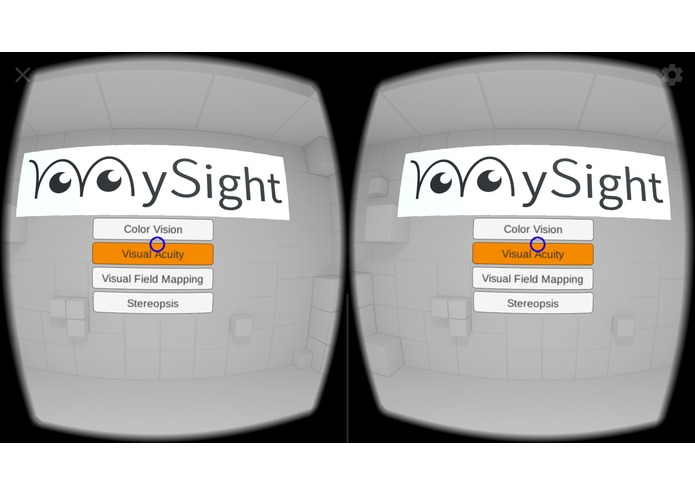
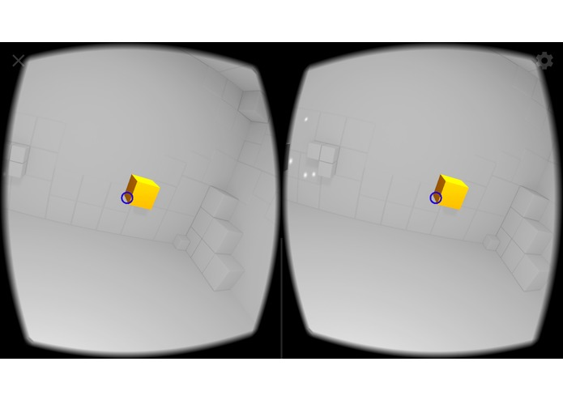
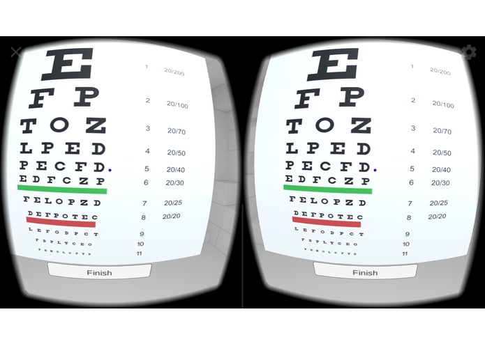

# HackPrinceton2017

# MySight: At-Home Vision System

https://devpost.com/software/mysight

## Inspiration
Vision is perhaps our most important sense; we use our sight every waking moment to navigate the world safely, to make decisions, and to connect with others. As such, keeping our eyes healthy is extremely important to our quality of life. In spite of this, we often neglect to get our vision tested regularly, even as we subject our eyes to many varieties of strain in our computer-saturated lives. Because visiting the optometrist can be both time-consuming and difficult to schedule, we sought to create MySight – a simple and inexpensive way to test our vision anywhere, using only a smartphone and a Google Cardboard virtual reality (VR) headset. This app also has large potential impact in developing nations, where administering eye tests cheaply using portable, readily available equipment can change many lives for the better.

## What it does
MySight is a general vision testing application that runs on any modern smartphone in concert with a Google Cardboard VR headset. It allows you to perform a variety of clinical vision tests quickly and easily, including tests for color blindness, stereo vision, visual acuity, and irregular blindspots in the visual field. Beyond informing the user about the current state of their visual health, the results of these tests can be used to recommend that the patient follow up with an optometrist for further treatment. One salient example would be if the app detects one or more especially large blindspots in the patient’s visual field, which is indicative of conditions requiring medical attention, such as glaucoma or an ischemic stroke.

## How we built it
We built MySight using the Unity gaming engine and the Google Cardboard SDK. All scripts were written in C#. Our website (whatswrongwithmyeyes.org) was generated using Angular2.

## Challenges we ran into
None of us on the team had ever used Unity before, and only two of us had even minimal exposure to the C# language in the past. As such, we needed to learn both Unity and C#.

## Accomplishments we're proud of
We are very pleased to have produced a working version of MySight, which will run on any modern smartphone.

## What we learned
Beyond learning the basics of Unity and C#, we also learned a great deal more about how we see, and how our eyes can be tested.

## What's next for mySight
We envision MySight as a general platform for diagnosing our eyes’ health, and potentially for improving eye health in the future, as we plan to implement eye and vision training exercises (c.f. Ultimeyes).

> Main Menu

> Stereopsis Test

> Visual Acuity Test
